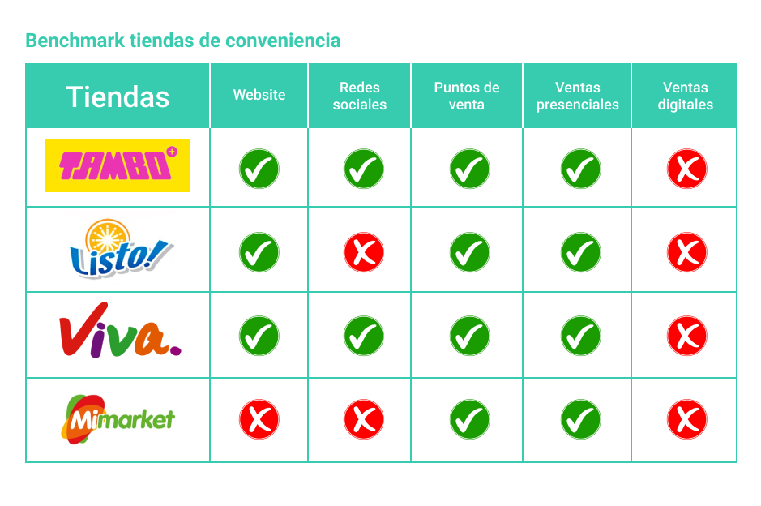
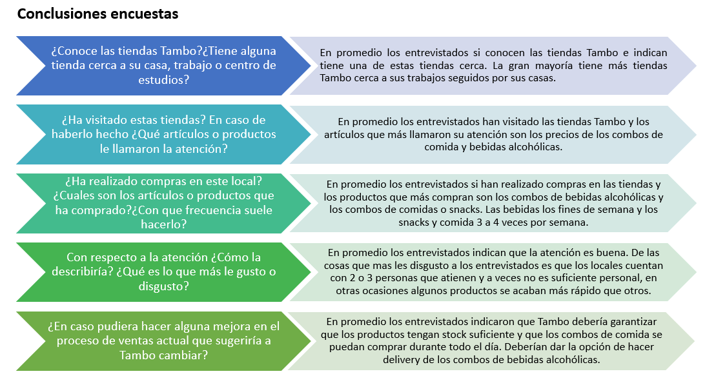

# Proceso de ventas digital: Tambo

- En la actualidad, la transformación digital viene brindando a las empresas nuevas herramientas y metodologías que permiten a los negocios ser más eficientes y detectar nuevas oportunidades.

- Es por ello, que muchas empresas vienen cambiando y modernizando sus procesos de negocios y el proceso de ventas no es ajeno a estos cambios. A través de este reto se busca tomar el proceso tradicional de ventas de Tambo y diseñar una nueva experiencia de ventas orientada a canales digitales.

## 1. Descubrimiento e Investigación

**Research situación actual**
- Actualmente, Tambo es la principal tienda de conveniencia a nivel local y forma parte de la empresa Great Retail la cual pertenece al grupo Lindcorp. Cuenta con 200 locales en Lima y espera cerrar el 2018 con 300 tiendas e inaugurar 100 tiendas por año hasta el 2021.

- Sus principales competidores son Primax la cual pertenece al grupo Romero y maneja las tiendas de Listo y Viva y la empresa InRetail que pertenece al grupo Intercorp y maneja las tiendas de Mimarket las cuales serán sacadas del mercado y darán paso a las nuevas tiendas Justo.

La participación del mercado de las tiendas de conveniencia se distribuye de la siguiente manera:

 

 

El éxito de Tambo radica en su concepto y propuesta de valor hacia los clientes la cual se enfoca en los siguientes puntos:

- El consumidor no necesita caminar hasta el supermercado para conseguir aquello que te falta, Tambo ofrece el mismo formato, pero más pequeño. No solo es una bodega evolucionada sino un supermercado simplificado. 

- Ofrece gran cantidad y variedad en la comida además de las ofertas. Los tamaños de porciones que se ofrecen no son pequeños sino contundentes, generosos y para el peruano promedio esto obedece a la lógica “Bueno, Bonito y Barato”.

Tambo no solo busca posicionarse en el mercado actual, sino que apuesta a la conquista del nuevo segmento juvenil y sus experiencias.

> *"Nuestra visión apunta a brindar nuevas soluciones a nuevas tendencias de consumo, principalmente para la clase media y para la gente más joven"*.  — Gerente general de Great Retail Luis Seminario

El mindset de los peruanos viene cambiando, y gracias a la apertura de Tambo podemos encontrar diferentes tipos de consumidores, estos han sido identificados por por Consumer Truth a través de un trendhunting, en el que se perfilan los potenciales clientes (“tribus urbanas”) de TAMBO. Estos son algunos de los resultados. 

Es por ello que en base a la información recopilada y analizando el modelo de negocio de Tambo podemos deducir lo siguiente

**Entrevistas**

Las preguntas realizadas buscan obtener información de los consumidores habituales sobre su experiencia a la hora de hacer las compras en los establecimientos de Tambo.

## 2. Síntesis y definición 

## 3. Ideación 

## 4. Prototipado

## 5. User testing

