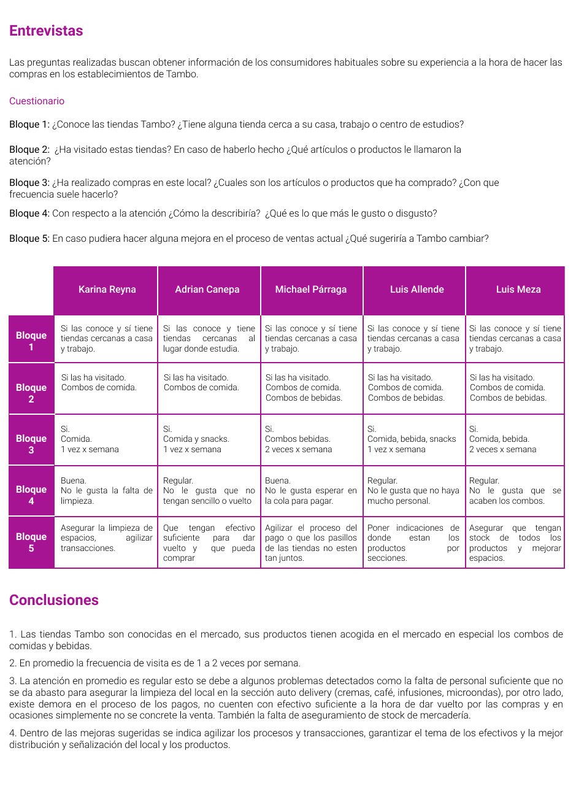

# Proceso de ventas digital: Tambo

- En la actualidad, la transformación digital viene brindando a las empresas nuevas herramientas y metodologías que permiten a los negocios ser más eficientes y detectar nuevas oportunidades.

- Es por ello, que muchas empresas vienen cambiando y modernizando sus procesos de negocios y el proceso de ventas no es ajeno a estos cambios. A través de este reto se busca tomar el proceso tradicional de ventas de Tambo y diseñar una nueva experiencia de ventas orientada a canales digitales.

## 1. Descubrimiento e Investigación

La participación del mercado de las tiendas de conveniencia se distribuye de la siguiente manera:

 

Es por ello que en base a la información recopilada y analizando el modelo de negocio de Tambo podemos deducir lo siguiente

**Entrevistas**

Las preguntas realizadas buscan obtener información de los consumidores habituales sobre su experiencia a la hora de hacer las compras en los establecimientos de Tambo.

## 2. Síntesis y definición 

**Definición del problema**

El proceso que se desea mejorar es la experiencia de los usuarios a la hora de hacer las compras para ello se busca digitalizar este proceso que permita mejorar esta experiencia y sirva a la empresa Tambo para optimizar sus procesos logisticos internos y lleve un mayor control de los productos que comercializa. 

**Customer journey map**

Actualmente el customer journey map del proceso de ventas es el siguiente:

 

**Benchmarking**

En base al research realizado comparamos las funcionalidades ofrecidas por Tambo vs su competencia directa teniendo los siguientes resultados:

 

**User person**

 

## 3. Ideación 

## 4. Prototipado

## 5. User testing

El siguiente prototipo digital fue realizado en Axure RP. Para tener una mejor experiencia a la hora de probar la demo tener en cuenta las siguientes consideraciones:

La vista esta desarrollada para ser visualizada en pantallas de 1200px, en caso tu pantalla no cuente con dicha resolución puedes acceder a las vistas rensponsive de Chrome pulsando F12 y seleccionando dicha resolución.

https://acgvp7.axshare.com/home.html

